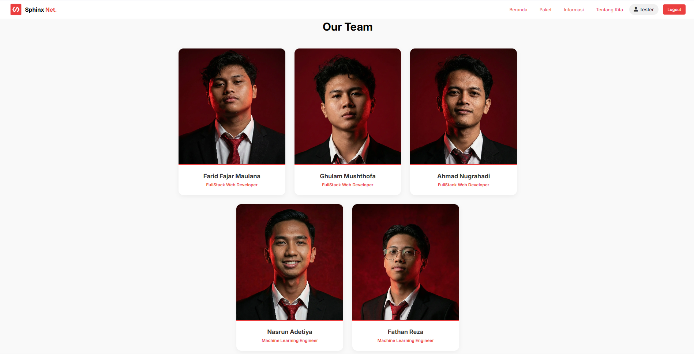

# Sphinx Net

[](https://github.com/wonderwall3393-alt/capstone-project/stargazers)
[](https://github.com/wonderwall3393-alt/capstone-project/network/members)
[](https://github.com/wonderwall3393-alt/capstone-project/watchers)
[](https://github.com/wonderwall3393-alt/capstone-project/blob/main/LICENSE)
[](https://python.org/)

**Sphinx Net** is a comprehensive telco recommendation platform designed to help users find the perfect internet package based on their behavior using AI-powered matching algorithms. This project is part of the **Capstone Project Team A25-CS026**.

Star ⭐ this repository if you like what you see 😉.


## ✨ About Sphinx Net

**Sphinx Net** provides a smart solution to personalize your internet experience. Unlike generic providers, our platform uses **Machine Learning** to analyze your device, usage habits, and budget to recommend the most suitable data package, preventing waste and increasing satisfaction.

## 🏦 Main Features

1.  ### 🤖 AI-Powered Recommendation

    Get personalized package suggestions based on your behavior using our RandomForest Classifier model.

2.  ### 📝 Interactive Survey System

    A comprehensive step-by-step survey to understand your specific needs (Gaming, Streaming, or Work).

3.  ### 🔐 Authentication Feature

    Secure login and registration system to manage your profile and purchase history.

4.  ### 📊 Data Visualization

    Monitor your data usage and package details through an intuitive dashboard with native CSS charts.

5.  ### 💳 Transaction Simulation

    Experience a seamless checkout process with digital invoice generation and payment verification.

6.  ### 📱 Responsive Design

    Fully optimized interface that works perfectly on Desktop, Tablet, and Mobile devices.

7.  ### 👤 User Profile Management

    Manage your personal information and view active package status effortlessly.

8.  ### 🌐 Dynamic Landing Page

    Real-time UI state management for guests and logged-in users.

## Screenshots

### User Interface

|                                                     |                                                         |                                                              |
| :-------------------------------------------------: | :-----------------------------------------------------: | :----------------------------------------------------------: |
|                    **Home Page**                    |                     **Survey Page**                     |                   **Katalog Package Page**                   |
|      |      |            |
|                   **Login Page**                    |                    **Register Page**                    |                      **Payment Succes**                      |
|    |  |  |
|                 **Success Invoice**                 |                    **Profile Page**                     |                     **Information Page**                     |
|  |         |          |

## 🛠️ Tech Stack

| Feature            | Technology                                                                                                                                                                                                                                                                                                                                    |
| ------------------ | --------------------------------------------------------------------------------------------------------------------------------------------------------------------------------------------------------------------------------------------------------------------------------------------------------------------------------------------- |
| Frontend Core      |    |
| Backend Server     |  (Native HTTP Server)                                                                                                                                                                                                                   |
| Machine Learning   |                                                                                                        |
| Database           |                                                                                                                                                                                                                                   |
| Icons              | [FontAwesome](https://fontawesome.com)                                                                                                                                                                                                                                                                                                        |
| Animations         | [AOS Library](https://michalsnik.github.io/aos/)                                                                                                                                                                                                                                                                                              |
| Data Visualization | Native CSS Conic Gradients                                                                                                                                                                                                                                                                                                                    |

## 🚀 How to Run

1.  Clone the repository

    ```bash
    git clone (https://github.com/wonderwall3393-alt/capstone-project)
    ```

2.  Navigate to the project directory

    ```bash
    cd capstone-project
    ```

3.  Start the Backend Server (Python)

    ```bash
    # Ensure you have Python installed
    python backend/hybrid_ml_survey_server.py
    ```

4.  Start the Application

    Open file in your browser or use a live server

## Contributor

**Farid Fajar Abdillah**
<br>
[](https://www.linkedin.com/in/farid-fajar-abdilah-87ba18336/)
[](https://github.com/wonderwall3393-alt)

**Ghulam Mushthofa**
<br>
[](https://www.linkedin.com/in/ghulam-mushthofa)
[](https://github.com/ghulambelajar)

**Ahmad Nugrahadi**
<br>
[](https://www.linkedin.com/in/nhadi23/)
[](https://github.com/Nhadi23)

**Nasrun Adetiya**
<br>
[](https://www.linkedin.com/in/nasyrun-adetiya-14b4a428b/)
[](https://github.com/adit321rr)

**Fathan Rezah**
<br>
[](https://linkedin.com/in/username)
[](https://github.com/masrezah)

## 📚 License

This project is licensed under the MIT License. See the [LICENSE](LICENSE) file for more details.

---

Thank you for visiting **Sphinx Net**! Let's connect the world with better internet recommendations.
