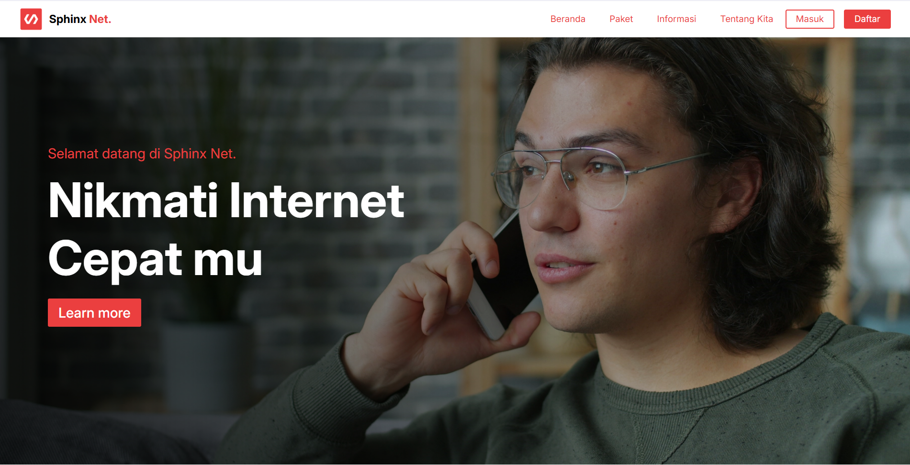
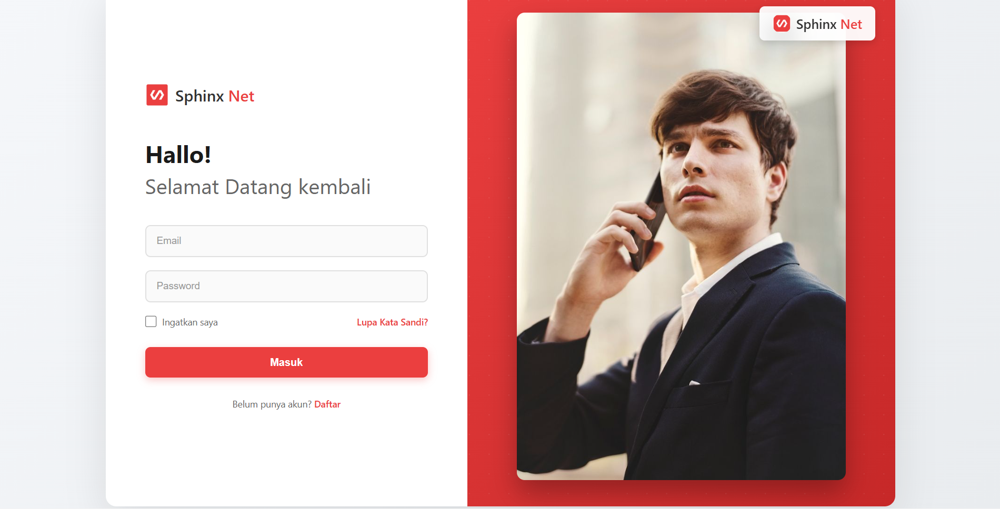
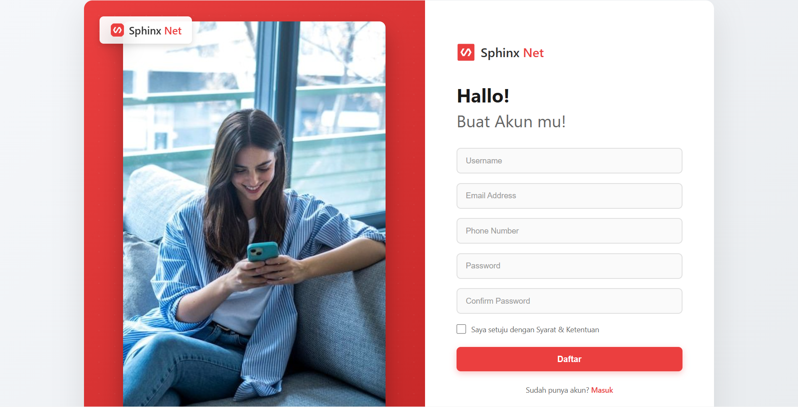
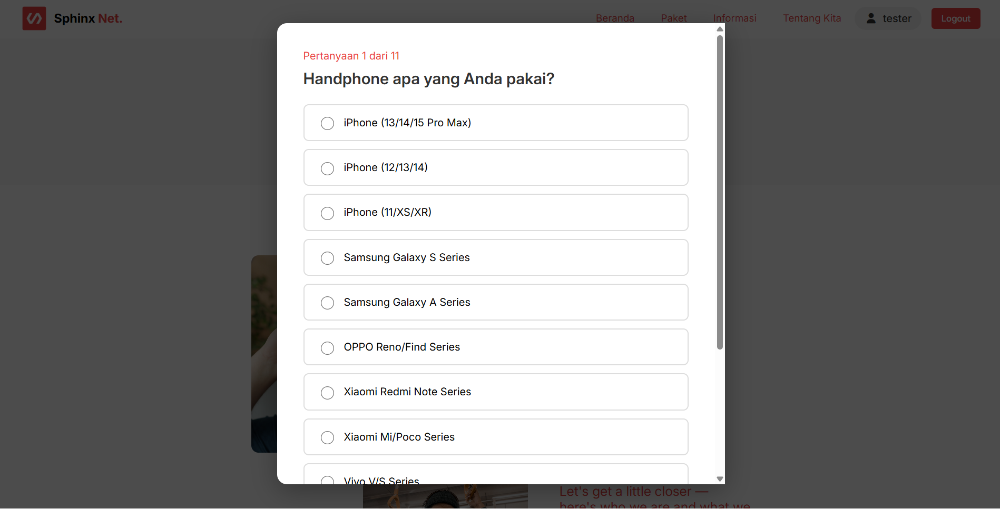
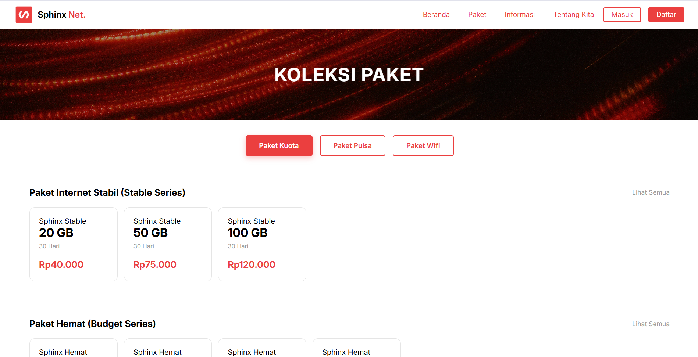
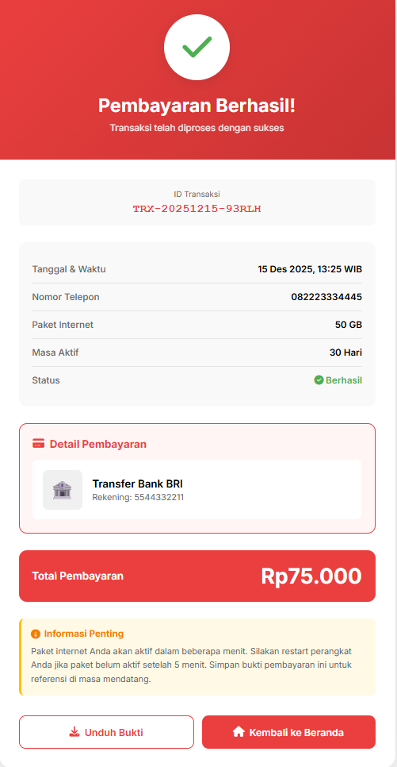
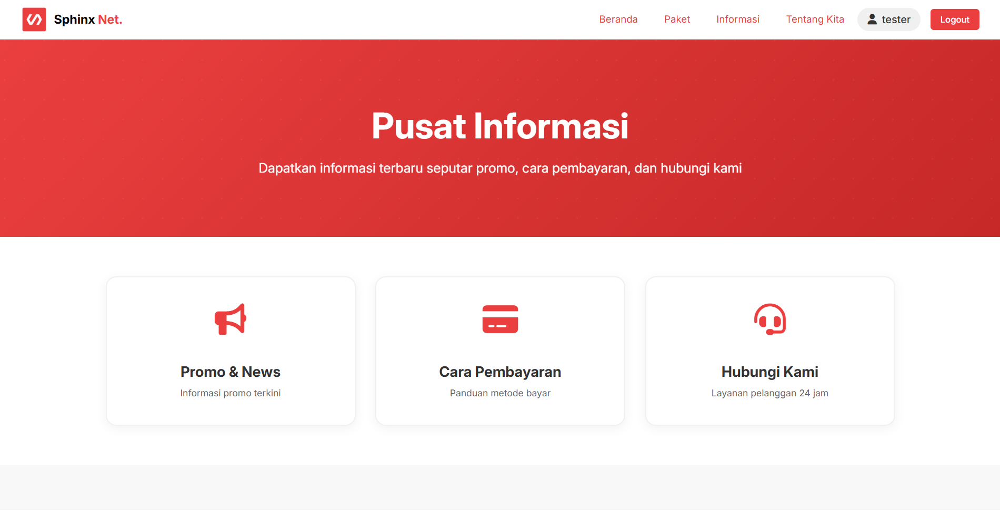
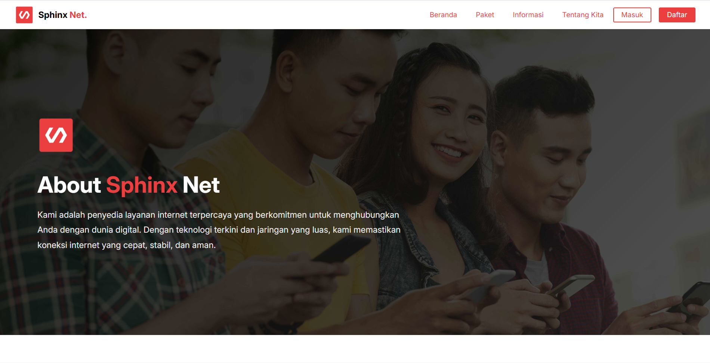
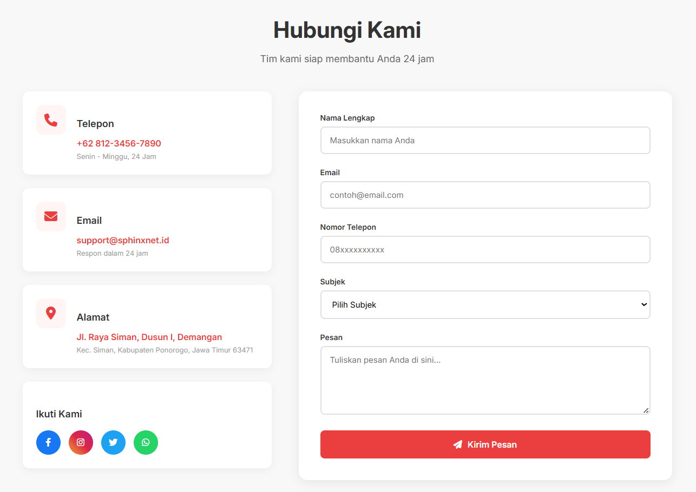
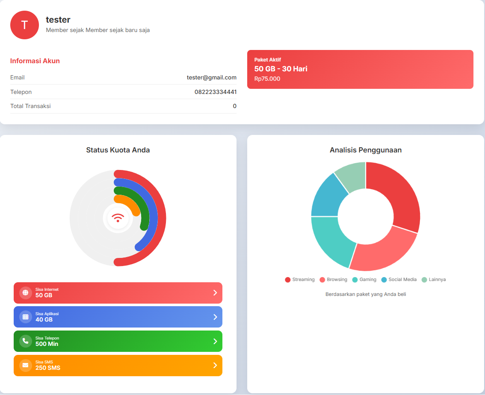

# Sphinx Net

[](https://github.com/wonderwall3393-alt/capstone-project/stargazers)
[](https://github.com/wonderwall3393-alt/capstone-project/network/members)
[](https://github.com/wonderwall3393-alt/capstone-project/watchers)
[](https://github.com/wonderwall3393-alt/capstone-project/blob/main/LICENSE)
[](https://python.org/)

**Sphinx Net** adalah platform rekomendasi telekomunikasi (Telco) komprehensif yang dirancang untuk membantu pengguna menemukan paket internet yang paling tepat berdasarkan perilaku mereka menggunakan algoritma pencocokan berbasis AI. Proyek ini merupakan bagian dari **Capstone Project Tim A25-CS026**.

Berikan Bintang ⭐ pada repositori ini jika Anda menyukainya 😉.



## ✨ Tentang Sphinx Net

**Sphinx Net** menyediakan solusi cerdas untuk mempersonalisasi pengalaman internet Anda. Berbeda dengan penyedia layanan umum, platform kami menggunakan **Machine Learning** untuk menganalisis perangkat, kebiasaan penggunaan, dan anggaran Anda guna merekomendasikan paket data yang paling sesuai, mencegah pemborosan kuota, dan meningkatkan kepuasan pelanggan.

## 🏦 Fitur Utama

1.  ### 🤖 Rekomendasi Berbasis AI

    Dapatkan saran paket yang dipersonalisasi berdasarkan perilaku Anda menggunakan model RandomForest Classifier.

2.  ### 📝 Sistem Survei Interaktif

    Survei langkah demi langkah yang komprehensif untuk memahami kebutuhan spesifik Anda (Gaming, Streaming, atau Pekerjaan).

3.  ### 🔐 Fitur Autentikasi

    Sistem login dan registrasi yang aman untuk mengelola profil dan riwayat pembelian Anda.

4.  ### 📊 Visualisasi Data

    Pantau penggunaan data dan detail paket Anda melalui dasbor intuitif dengan grafik CSS native.

5.  ### 💳 Simulasi Transaksi

    Rasakan proses checkout yang mulus dengan pembuatan faktur digital dan verifikasi pembayaran.

6.  ### 📱 Desain Responsif

    Antarmuka yang dioptimalkan sepenuhnya dan bekerja sempurna di Desktop, Tablet, dan perangkat Seluler.

7.  ### 👤 Manajemen Profil Pengguna

    Kelola informasi pribadi dan lihat status paket aktif dengan mudah.

8.  ### 🌐 Halaman Landing Dinamis

    Manajemen status UI (User Interface) secara real-time untuk tamu dan pengguna yang sudah login.

## Tangkapan Layar (Screenshots)

### Antarmuka Pengguna

|                                                            |                                                               |                                                                 |
| :--------------------------------------------------------: | :-----------------------------------------------------------: | :-------------------------------------------------------------: |
|                     **Halaman Login**                      |                      **Halaman Daftar**                       |                        **Halaman Utama**                        |
|           |        |                  |
|                     **Halaman Survey**                     |                   **Halaman Katalog Paket**                   |                      **Pembayaran Sukses**                      |
|         |    |  |
|                     **Invoice Sukses**                     |                     **Halaman Informasi**                     |                         **Halaman Tim**                         |
|  |  |                  |
|               **Halaman Tentang Sphinx Net**               |                   **Halaman Hubungi Kami**                    |                      **Halaman Dashboard**                      |
|          |            |                 |

## 🛠️ Teknologi yang Digunakan (Tech Stack)

| Fitur            | Teknologi                                                                                                                                                                                                                                                                                                                                     |
| ---------------- | --------------------------------------------------------------------------------------------------------------------------------------------------------------------------------------------------------------------------------------------------------------------------------------------------------------------------------------------- |
| Frontend Core    |    |
| Backend Server   |  (Native HTTP Server)                                                                                                                                                                                                                   |
| Machine Learning |                                                                                                        |
| Penyimpanan Data |                                                                                                                                                                                                                                                |
| Ikon             | [FontAwesome](https://fonts.google.com/specimen/Inter?query=inter)                                                                                                                                                                                                                                                                            |
| Animasi          | [AOS Library](https://michalsnik.github.io/aos/)                                                                                                                                                                                                                                                                                              |
| Visualisasi Data | Native CSS Conic Gradients                                                                                                                                                                                                                                                                                                                    |

## 🚀 Cara Menjalankan

1.  Clone repositori ini

    ```bash
    git clone (https://github.com/wonderwall3393-alt/capstone-project))
    ```

2.  Masuk ke direktori proyek

    ```bash
    cd capstone-project
    ```

3.  Jalankan Server Backend (Python)

    ```bash
    # Pastikan Anda sudah menginstal Python
    python backend/hybrid_ml_survey_server.py
    ```

4.  Jalankan Aplikasi

    Buka file `index.html` atau `home-before.html` di browser Anda, atau gunakan live server.

## Kontributor

**Farid Fajar Abdillah**
<br>
[](https://www.linkedin.com/in/farid-fajar-abdilah-87ba18336/)
[](https://github.com/wonderwall3393-alt)

**Ghulam Mushthofa**
<br>
[](https://www.linkedin.com/in/ghulam-mushthofa)
[](https://github.com/ghulambelajar)

**Ahmad Nugrahadi**
<br>
[](https://www.linkedin.com/in/nhadi23/)
[](https://github.com/Nhadi23)

**Nasrun Adetiya**
<br>
[](https://www.linkedin.com/in/nasyrun-adetiya-14b4a428b/)
[](https://github.com/adit321rr)

**Fathan Rezah**
<br>
[](https://www.linkedin.com/in/mas-rezah-04301727b/)
[](https://github.com/masrezah)

## 📚 Lisensi

Proyek ini dilisensikan di bawah Lisensi MIT. Lihat file [LICENSE](LICENSE) untuk detail selengkapnya.

---

Terima kasih telah mengunjungi **Sphinx Net**! Mari hubungkan dunia dengan rekomendasi internet yang lebih baik.
